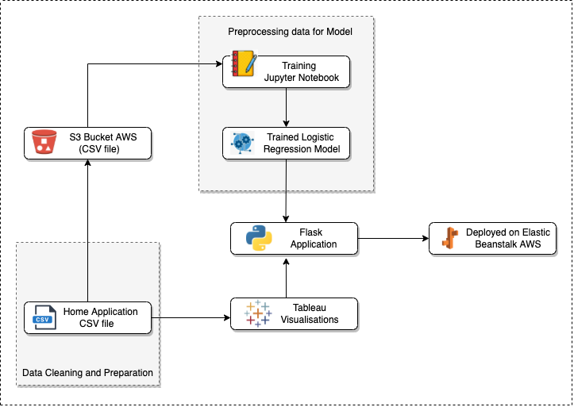
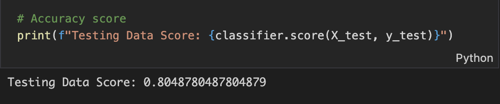
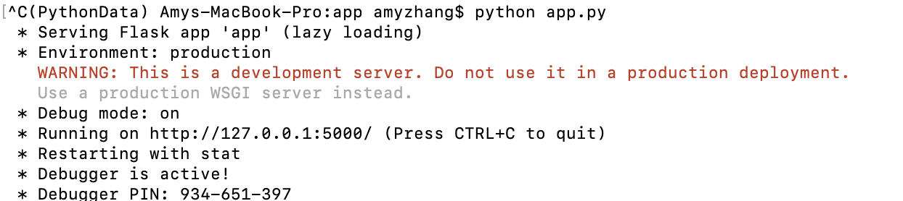
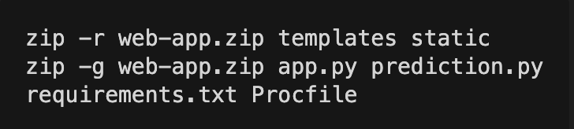

# **Home Loan Prediction using Machine Learning**

<h3><b>Purpose and Motivation</b></h3>

A lot of factors are considered when making the decision wheather or not a home loan is approved by Banks or other financial institutions. 

With the help of machine learning and the details of an applicants details of their current living and financial situations, we can predict if the applicant is eligible for a particular home loan or not.

Following this notion, I was curious to investigate any trends in terms of the loan status of all the home loan applications and whether a few independent variables together alone from a financial perspective would affect the loan status.

<h3><b>Solution Architecture</b></h3>

<h3><b>About the Data</b></h3>

The dataset used in this project is found on <a href="https://www.kaggle.com/">Kaggle.com</a>

Below shows the variables and its definitions

Variable|Definition|
|:----------|:----------|
|Gender|Male or Female|
|Married|Applicant Married (Y/N)|
|Dependants|Number of dependents the applicant has|
|Self_Employed|Is the applicant self-employed? (Y/N)|
|Total_Income|Applicant's and Co-applicant's (if applicable) income combined| 
|LoanAmount|The loan amount the apllicant wishes to apply for (in thousands)|
|Credit_History|0.0: Applicant has not repaid their previous debt  1.0: Applicant has repaid their previous debt|
|Property_Area|What area type is the property located at? (Urban/SemiUrban/Rural)|

<h3><b>Selecting the Model</b></h3>

For this project, the type of Machine Learning algorithm that was focussed on was Supervised Learning. The ML algorithm was given a sample of data to train on where the dependent variable being the approval loan status was present.

The remiaing data set was used as the test sample and the dependent variable is removed to see how accurate the model is.

The chosen model for this project is a Logistic Regression model where the prediction will be classified as either the home loan will be approved (Y) or the home loan will not be approved (N)

<b><u>Model Metrics</u></b>
 
 

<h3><b>Usage</b></h3>

<h3><b>1. How to install Python requirements/ dependencies</b></h3>
  
Pip install requirement.txt in terminal to install.
<h3><b>2. How to run the code locally</b></h3>
  
In terminal, run python app.py in the PythonData environment and copy the url into your web browser

  

  

  

  
Once the app is built, the second task is to create an application on the <a href="https://aws.amazon.com/free/?all-free-tier.sort-by=item.additionalFields.SortRank&all-free-tier.sort-order=asc&awsf.Free%20Tier%20Types=*all&awsf.Free%20Tier%20Categories=categories%23compute&trk=ps_a134p000006gERGAA2&trkCampaign=acq_paid_search_brand&sc_channel=PS&sc_campaign=acquisition_ANZ&sc_publisher=Google&sc_category=Cloud%20Computing&sc_country=ANZ&sc_geo=APAC&sc_outcome=acq&sc_detail=%2Bamazon%20%2Bweb%20%2Bservices%20%2Bserver&sc_content=Cloud%20Server_bmm&sc_matchtype=b&sc_segment=476956951578&sc_medium=ACQ-P|PS-GO|Brand|Desktop|SU|Cloud%20Computing|Solution|ANZ|EN|Text&s_kwcid=AL!4422!3!476956951578!b!!g!!%2Bamazon%20%2Bweb%20%2Bservices%20%2Bserver&ef_id=CjwKCAiAgvKQBhBbEiwAaPQw3PNkYExyswyeaOuuxT4eInkSq_w_TxbJH80Mb8aMydT7Ah7ankYNOBoCBXYQAvD_BwE:G:s&s_kwcid=AL!4422!3!476956951578!b!!g!!%2Bamazon%20%2Bweb%20%2Bservices%20%2Bserver">AWS Website.</a>
  
One the application is created, I had to create an environment where I uploaded my zip file containing my code.

  
<a href="http://homeloanapp-env.eba-t4a32fmj.ap-southeast-2.elasticbeanstalk.com/">Click Here</a> to view my web application and predict whether or not your loan will be approved.

